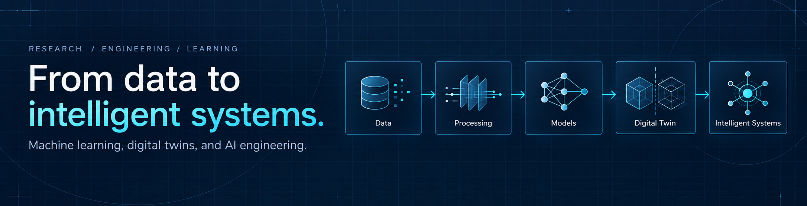
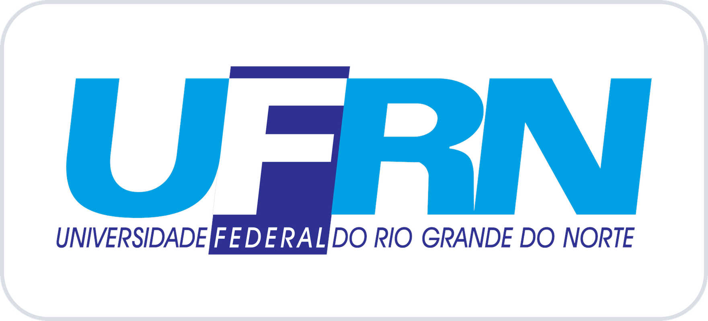
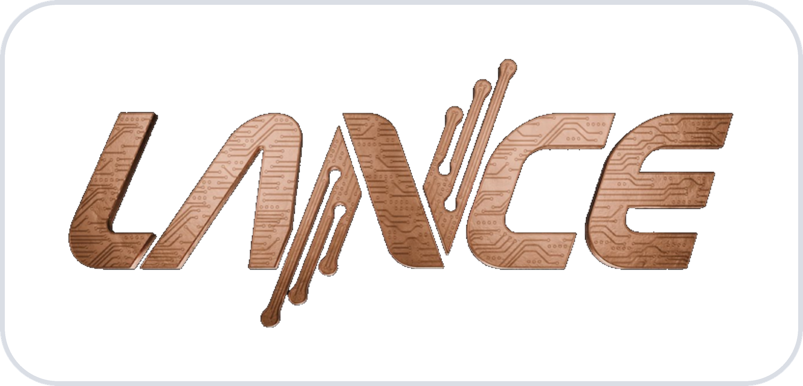
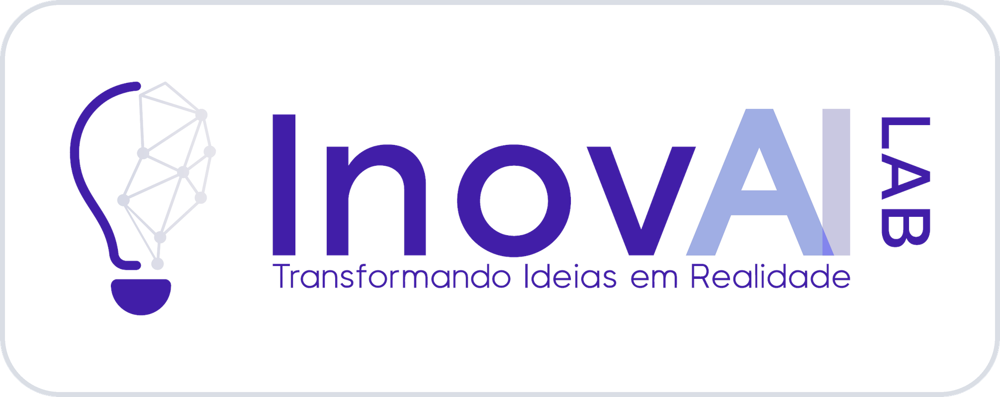

# Hi, I'm Micarlos Teixeira 👋

**Artificial Intelligence Researcher · AI Developer · Computer Engineering Student**

I build intelligent systems that connect **data, machine learning, generative AI, and the physical world**.

🎓 M.Sc. student in Electrical and Computer Engineering at the Federal University of Rio Grande do Norte (UFRN) 
🔬 AI researcher at the Artificial Intelligence Innovation Laboratory (InovAI Lab); AI Developer at the Leading Advanced Technologies Center of Excellence (LANCE) 
🏭 Researching Digital Twins, Industrial AI & Predictive Modeling 
🤖 Exploring AI Engineering, Retrieval-Augmented Generation (RAG), agents & ML systems

  <a href="mailto:micarlos.contato@gmail.com">Email</a>
  ·
  <a href="https://lattes.cnpq.br/0808298106536576">Lattes</a>

---

## About

I am a master's student in the Graduate Program in Electrical and Computer Engineering (PPgEEC) at the [Federal University of Rio Grande do Norte (UFRN)](https://www.ufrn.br/en), Brazil, where I also study Computer Engineering. My research area is **Intelligent Information Processing**.

I work at the [Leading Advanced Technologies Center of Excellence (LANCE)](https://lance.ufrn.br/sobre/), a research and development center at UFRN's Digital Metropolis Institute. Within LANCE, I am a researcher at [InovAI Lab](https://lance.ufrn.br/laboratorios/), its laboratory for AI research and innovation.

  
  &nbsp;&nbsp;&nbsp;&nbsp;
  
  &nbsp;&nbsp;&nbsp;&nbsp;
  

---

## Selected Work

| Project | Area | Role | What I do |
|---|---|---|---|
| **Digital Twins for Textile Manufacturing** | Industrial AI | Researcher @ InovAI Lab | Predictive modeling, industrial data integration, digital twins, and generative AI for monitoring and predicting equipment behavior |
| **AI-Based Cybersecurity** | Energy & Cybersecurity | AI Developer @ LANCE | Development, evaluation, and integration of machine learning models for thermoelectric plant security |

---

## Areas of Interest

- **Machine Learning** — predictive modeling, ensemble methods, feature engineering, model evaluation, clustering, classification, and regression
- **Generative AI** — Transformers, embeddings, foundation models, RAG, agents, and application evaluation
- **Industrial AI** — digital twins, sensor and production data, predictive systems, computational modeling, and intelligent monitoring
- **ML Systems** — experiment tracking, reproducibility, model serving, monitoring, deployment, and reliability

---

## Tech Stack

<table align="center">
  <tr>
    <td align="center" width="96"> Python</td>
    <td align="center" width="96"> scikit-learn</td>
    <td align="center" width="96"> PyTorch</td>
    <td align="center" width="96"> Hugging Face</td>
    <td align="center" width="96"> LangChain</td>
    <td align="center" width="96"> FastAPI</td>
  </tr>
  <tr>
    <td align="center" width="96"> MLflow</td>
    <td align="center" width="96"> W&B</td>
    <td align="center" width="96"> DVC</td>
    <td align="center" width="96"> Docker</td>
    <td align="center" width="96"> Git</td>
    <td align="center" width="96"> JupyterLab</td>
  </tr>
</table>

### Languages & Data
Python · SQL · PostgreSQL · Pandas · NumPy

### Machine Learning
scikit-learn · XGBoost · LightGBM · SVMs · k-means · DBSCAN · Prophet

### Deep Learning & Generative AI
PyTorch · Hugging Face Transformers · CNNs · sequence models · embeddings · autoencoders · VAEs · GANs · LangChain

### ML Engineering
MLflow · Weights & Biases · DVC · FastAPI · Docker · Git · GitHub · JupyterLab

---

## Currently Exploring

- **Digital Twins and Industrial AI**
- **LLM systems, Retrieval-Augmented Generation and AI Agents**
- **ML Systems Design, MLOps and production ML**
- **Evaluation, reliability and observability for AI applications**

---

## Education & Academic Background

- 🎓 **M.Sc. in Electrical and Computer Engineering** *(in progress)* — UFRN
- 🎓 **B.Eng. in Computer Engineering** *(in progress)* — UFRN
- 🎓 **B.Sc. in Science and Technology**, emphasis in Computer Technology — UFRN
- 📚 Former Teaching Assistant for **Calculus I, Linear Algebra and Vector Geometry** — UFRN

---

## On GitHub

I use GitHub primarily for **research code, machine learning experiments, AI engineering projects, and technical studies**. Some repositories related to funded research and industry projects are private.

---

## Let's Connect

I am interested in collaborations involving **machine learning, industrial AI, digital twins, generative AI, AI engineering, and intelligent systems**.

Some of my research and industry projects are hosted in private repositories. Additional technical details and project demonstrations are available upon request.

📫 **[micarlos.contato@gmail.com](mailto:micarlos.contato@gmail.com)**
